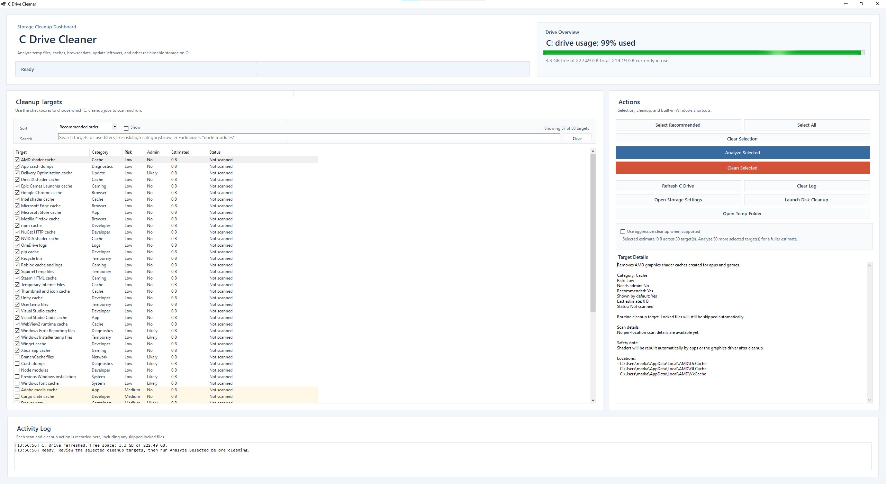

# C Drive Cleaner

A Windows Forms desktop app for analyzing and removing reclaimable files on the `C:` drive.



## What it includes

- A multi-button cleanup dashboard for common storage targets
- A checkbox list for choosing cleanup actions
- Sorting by estimated reclaimable size, risk, or name
- Advanced target search with quoted phrases, exclusions, and field filters
- Relevance-aware target filtering with an option to show everything
- Aggregate selected-space estimate for the checked targets
- Live scan ETA during Analyze Selected, based on per-target scan timing
- Command-backed cleanup for system-managed targets like WinSxS and Docker
- Per-location scan details for targets such as `node_modules` and WSL virtual disks
- Picker-based cleanup for project folders and disk-image targets
- Drive usage summary for `C:`
- Per-target scan estimates before cleanup
- Activity log with skipped locked/protected files
- Quick launch buttons for Windows Storage Settings, Disk Cleanup, and your temp folder

## Cleanup targets included

- User temp files
- Windows temp files
- Recycle Bin
- Downloads folder
- Thumbnail and icon cache
- DirectX shader cache
- App crash dumps
- System memory dumps
- Delivery Optimization cache
- Windows Update downloads
- Windows Component Store cleanup
- Microsoft Edge cache
- Google Chrome cache
- Mozilla Firefox cache
- Brave browser cache
- Opera cache
- WebView2 runtime cache
- Microsoft Store cache
- Spotify cache
- Slack cache
- Zoom cache
- Epic Games Launcher cache
- Battle.net cache
- EA app cache
- Ubisoft Connect cache
- Microsoft Teams cache
- Discord cache
- Visual Studio Code cache
- Steam HTML cache
- GitHub Desktop cache
- Postman cache
- Notion cache
- Telegram Desktop cache
- Squirrel temp files
- NuGet HTTP cache
- NuGet global packages
- npm cache
- pnpm store
- Yarn cache
- pip cache
- Node modules
- Python virtual environments
- Gradle cache
- Maven local repository
- Cargo crate cache
- Conda package cache
- Docker data
- Old virtual machines / emulator disks
- WSL virtual disks
- Unity cache
- Unreal Engine derived data cache
- Adobe media cache
- Roblox cache and logs
- OneDrive logs
- Windows Defender scan history
- Windows Error Reporting files
- Windows update logs
- Previous Windows installation
- Windows upgrade leftovers
- IIS logs
- BranchCache files
- Intel shader cache
- AMD shader cache
- NVIDIA shader cache
- Prefetch files

## Build requirements

This project targets `net8.0-windows` and needs the **.NET 8 SDK** installed.

The current environment where this project was generated only had the .NET runtime, not the SDK, so the project could not be compiled or tested here.

## Run

After installing the .NET 8 SDK:

```powershell
dotnet restore
dotnet build
dotnet run
```

## Notes

- Some cleanup options are marked as more advanced and may require administrator rights.
- Locked files are skipped rather than forcing deletion.
- Browser cache cleanup works best when Edge and Chrome are closed first.
- Search supports plain terms plus filters like `risk:high`, `category:browser`, `admin:yes`, `recommended:no`, and negation with `-term`.
- The Prefetch option is included because you asked for many choices, but it is intentionally marked as advanced rather than recommended.
